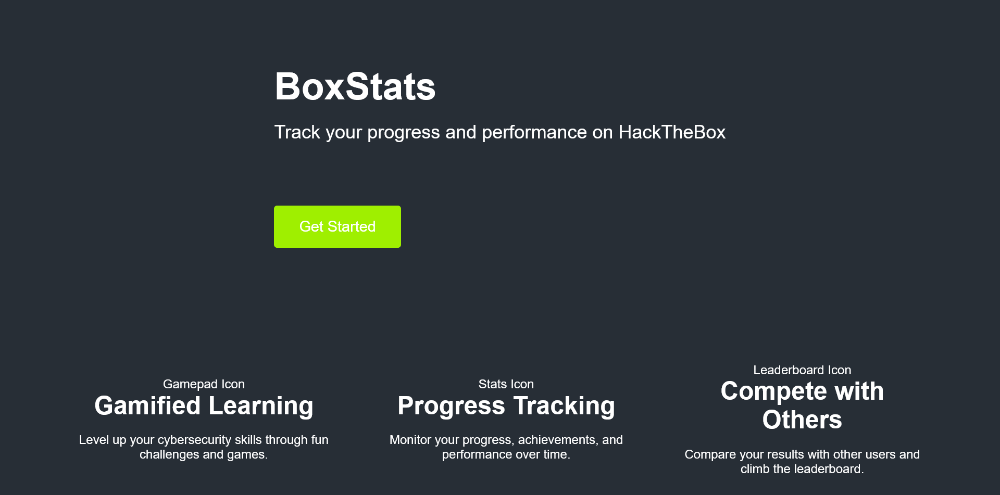
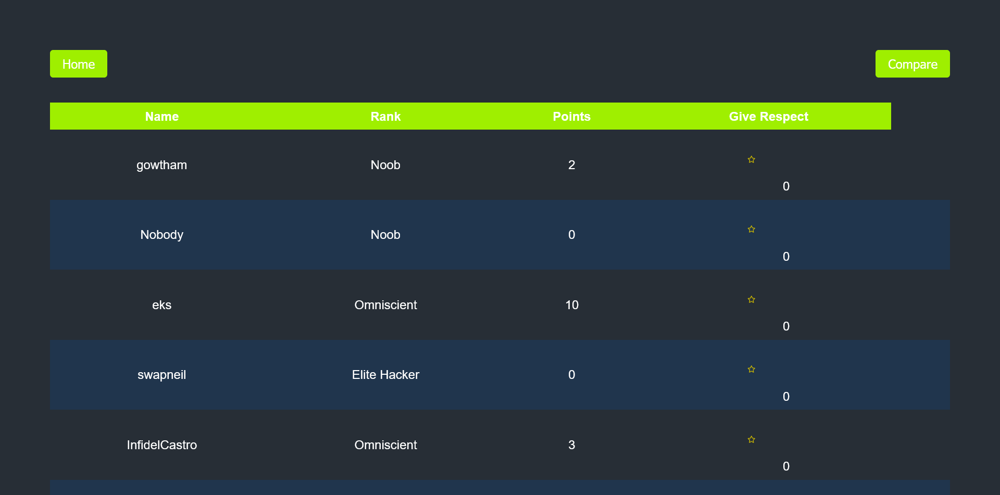
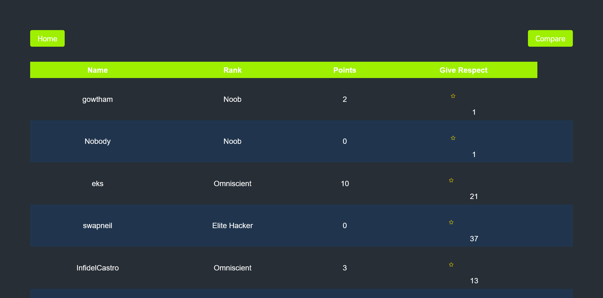

# HTB-Stats
A web application where HackTheBox users can track their global ranking, compare their achievements with that of others and give respect to outstanding players. It leverages the HTB API to seamlessly retrieve and display players' statistical data.

## Setup Requirements
- HackTheBox API key(https://www.hackthebox.com/home)
- Git
- Web browser
- Live Server

## Setup Installation
1. Copy the Github Repo url.
2. Open a terminal on your local environment and clone the repo.
3. Install Live Server extension for Vs Code and ensure it is running.
4. Open your browser and enter the following url: http://127.0.0.1:5500/

## Technologies Used
- HTML
- CSS
- JavaScript
- HTB API

## Site Screenshots
- Landing Page

- Player Statistics

- Player Statistics: Respect

