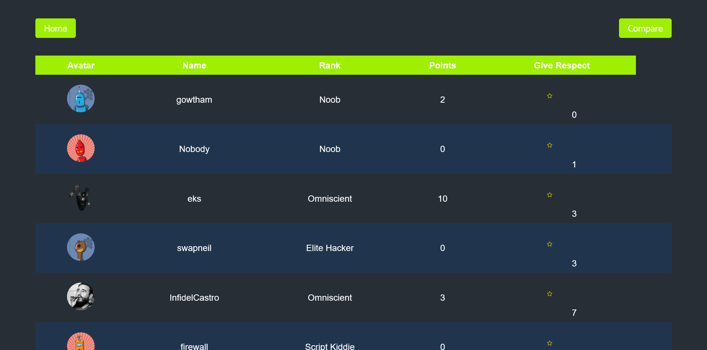
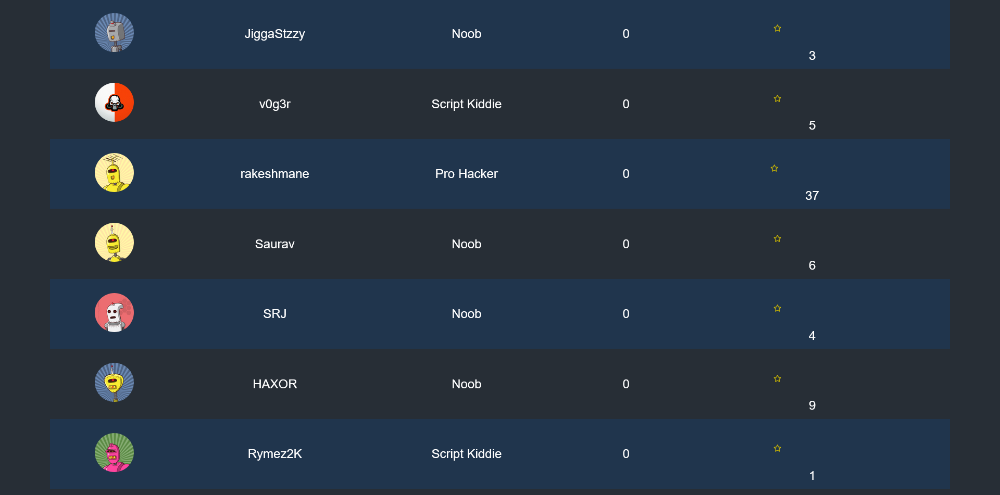

# HTB-Stats
A web application where HackTheBox users can track their global ranking, compare their achievements with that of others and give respect to outstanding players. It leverages the HTB API to seamlessly retrieve and display players' statistical data.

## Setup Requirements
- HackTheBox API key(https://www.hackthebox.com/home)
- Git
- Web browser
- Live Server

## Setup Installation
1. Copy the Github Repo url.
2. Open a terminal on your local environment, clone the repo and move inside the directory (HTB-Stats).
3. Create an account on HackTheBox. Head over to the following endpoint: https://app.hackthebox.com/profile/settings then create an app token that you'll need to perform requests to the HTB API.
4. Open the index.html file available in the directory and set the value of `YOUR_AUTH_TOKEN` to the app token from step 3 above
5. Install Live Server extension for Vs Code and ensure it is running.
6. Open your browser and navigate to the following url: http://127.0.0.1:5500/ . The site should be up and running.

## Minor Fixes
`CORS issues`
1. The browser blocks any cross origin requests to the HTB API.
  - This can be circumvented through using an extension that allows you to perform cross-domain requests

## Technologies Used
- HTML
- CSS
- JavaScript
- HTB API

## Site Screenshots
- Landing Page

- Player Statistics

- Player Statistics: Respect

## License
MIT License

Copyright (c) 2023 Ian Raburu

Permission is hereby granted, free of charge, to any person obtaining a copy
of this software and associated documentation files (the "Software"), to deal
in the Software without restriction, including without limitation the rights
to use, copy, modify, merge, publish, distribute, sublicense, and/or sell
copies of the Software, and to permit persons to whom the Software is
furnished to do so, subject to the following conditions:

The above copyright notice and this permission notice shall be included in all
copies or substantial portions of the Software.

THE SOFTWARE IS PROVIDED "AS IS", WITHOUT WARRANTY OF ANY KIND, EXPRESS OR
IMPLIED, INCLUDING BUT NOT LIMITED TO THE WARRANTIES OF MERCHANTABILITY,
FITNESS FOR A PARTICULAR PURPOSE AND NONINFRINGEMENT. IN NO EVENT SHALL THE
AUTHORS OR COPYRIGHT HOLDERS BE LIABLE FOR ANY CLAIM, DAMAGES OR OTHER
LIABILITY, WHETHER IN AN ACTION OF CONTRACT, TORT OR OTHERWISE, ARISING FROM,
OUT OF OR IN CONNECTION WITH THE SOFTWARE OR THE USE OR OTHER DEALINGS IN THE
SOFTWARE.

